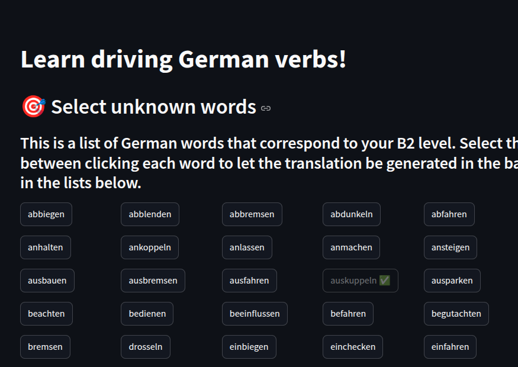
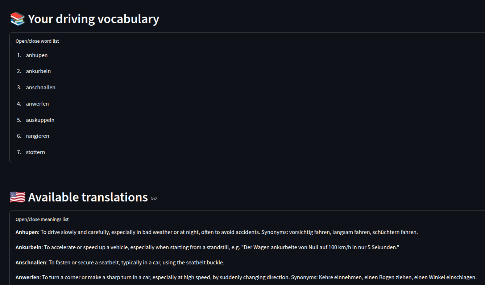

# Language Learning Konstantina

Personalized LLM-based application to assist language learning.

This Streamlit app helps users expand their foreign language vocabulary via a curated list of topic-related words tailored to their language level. Users can mark unfamiliar words, which are automatically translated in English in the background. These new words, along with their explanations, are then stored and displayed in the app. It serves as an effective tool for learning, reviewing, and reinforcing vocabulary.

# Installation

Create a `.env` file based on `.env_`.
Run the following:
```
poetry install
eval $(poetry env activate)
export POETRY_PLUGIN_DOTENV_LOCATION=.env
```

# Usage

## Prerequisites

The app assumes the input data for building the user's vocabulary exists and it is stored in `vocabulary.json`.
For example, with regards to driving a car and learning German, on app start the file could look like:
```json
{
  "driving": {
    "known": [
      "abbiegen",
      "halten",
      "kuppeln",
      "rasen",
      "vermieten"
    ],
    "unknown": [
    ]
  }
}
```
`known` contains the presumably known words that belong to the user's language level and `unknown` will be gradually filled with the words the user selects to learn or recap.

## Run

```

poetry run -vvv streamlit run streamlit_app.py

```

The app would look like:



